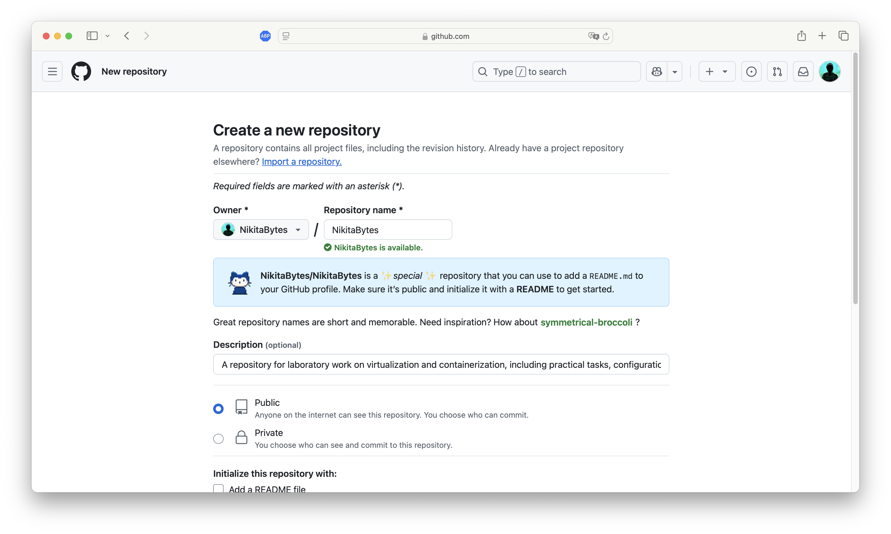
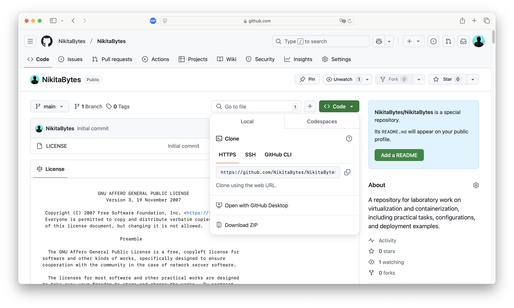
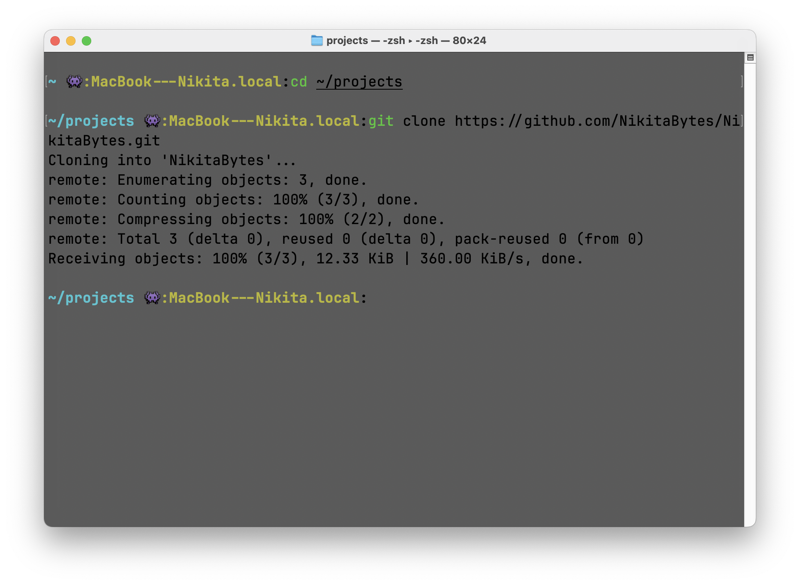
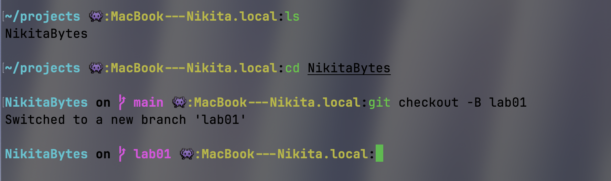
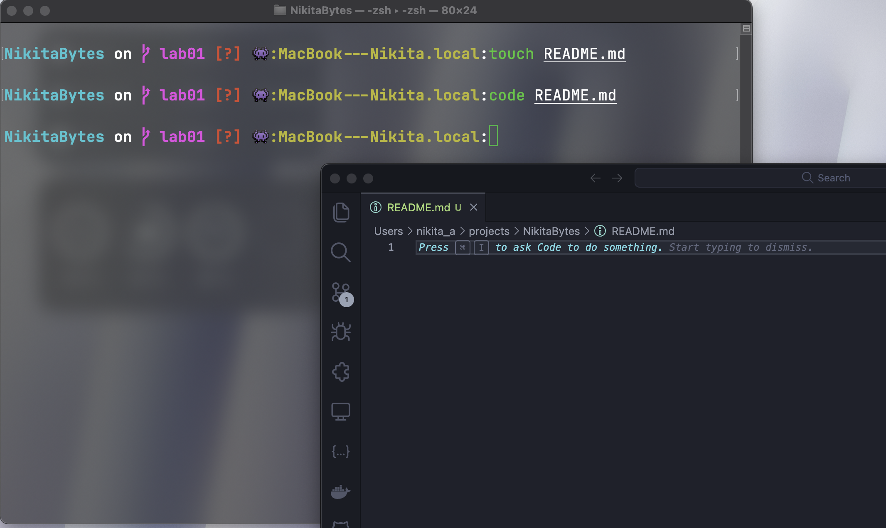
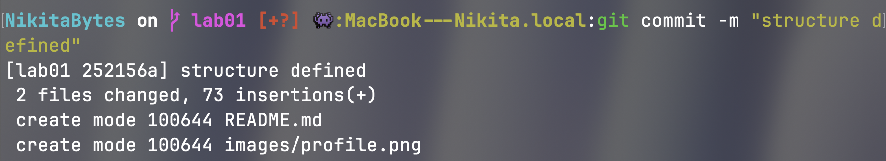

# 👋 Приветствие
Привет! Добро пожаловать в мой репозиторий! 🚀  
Здесь собраны лабораторные работы по **виртуализации** и **контейнеризации**, а также другие разработки.

---

# 🖼 Фотография / Аватар
Вот мой аватар с **GitHub**:


---

# 👨‍💻 Краткое описание себя
Я — **Никита Савка**, увлечённый разработчик, специализирующийся на **веб-технологиях, криптографии и блокчейне**.  
Моя основная платформа — **macOS на M3**, и я предпочитаю писать код **быстро, качественно и оптимизированно**.

✨ **Что меня отличает?**
- **Максимальная продуктивность** 🚀  
- **Гибкость и мобильность** 🔥  
- **Способность быстро адаптироваться к новым технологиям** ⚡  
- **Создание минималистичных и стильных интерфейсов** 🎨  
- **Глубокий интерес к криптографии и NFT** 🛠  

Помимо программирования, я интересуюсь технологиями **Web3** и **разработкой Telegram-мини-приложений**.

---

# 📌 Области интересов
- Разработка **веб-приложений** 🖥  
- Мини-приложения для **Telegram** 🤖  
- **Криптография, блокчейн и NFT** ⛓  
- Оптимизация кода и **чистая архитектура** 🏗  
- **Бэкенд-разработка** и безопасность серверов 🛡  
- Гейм-дев и игровые механики 🎮  

---

# 💻 Языки программирования

### ✅ Знаю и использую:
- **JavaScript / TypeScript**
- **Java**
- **Tact** (язык для блокчейн-контрактов TON)
- **C++**
- **Rust**
- **PHP**
- **Python**

### 📚 Постоянно изучаю и обновляю знания по:
> Так как технологии и языки программирования **быстро развиваются**, я регулярно обновляю свои знания, изучая новые фреймворки, библиотеки и изменения в **JavaScript, TypeScript, Rust, Tact, C++** и других языках.  
> Постоянные обновления — **ключ к актуальному и оптимизированному коду**.

### 🎯 Хочу изучить:
- **Dart** (Flutter)
- **Kotlin** (Android)
- **Go**
- **C#**
- **Swift**
- **Objective-C**

---

# 📬 Как со мной связаться?
📢 Самый удобный способ связи — **Telegram**!

🔹 **Мой профиль:**

[](https://t.me/Luminix_x)

✉ **[@Luminix_x](https://t.me/Luminix_x)** — **можно написать, если есть вопросы!**

---

# Лабораторная работа №2. Работа с GIT

## Студент
- **Имя и Фамилия:** Никита Савка 
- **Группа:** I2302
- **Платформа:** MacOS на M3
- **Дата выполнения:** 19.02.2025
- **Ссылка на репозиторий с изображениями и лабораторной работой:** https://github.com/NikitaBytes/NikitaBytes

## Цель лабораторной работы

Данная лабораторная работа направлена на изучение основ работы с системой контроля версий Git. В ходе выполнения работы студент:

- Освоит процесс создания удалённого репозитория на GitHub.
- Научится клонировать репозиторий на локальный компьютер.
- Ознакомится с базовыми операциями Git: создание веток, добавление файлов, коммиты и отправка изменений в удалённый репозиторий.
- Создаст файл `README.md` с описанием проекта, используя разметку Markdown.
- Научится структурировать репозиторий, добавляя каталоги и файлы.
- Публикует свою работу на GitHub, соблюдая требования к оформлению.

## Описание выполнения работы

В данном разделе я подробно описываю процесс выполнения лабораторной работы, начиная с регистрации на GitHub и заканчивая публикацией кода на удалённом репозитории. Ниже приведены этапы работы, с описанием использованных команд, шагов и результатов, а также с добавлением скриншотов, подтверждающих выполнение каждого этапа.

### 1. Регистрация на GitHub

У меня уже есть верифицированный аккаунт на GitHub, поэтому процесс регистрации мне не нужен. Если же у вас аккаунта ещё нет, вот пошаговая инструкция по его созданию.

#### Создание аккаунта на GitHub

1. **Переход на сайт GitHub**  
   Откройте браузер и зайдите на [официальный сайт GitHub](https://github.com).

2. **Заполнение регистрационной формы**  
   - Введите уникальное имя пользователя.  
   - Укажите email, который будет использоваться для входа и получения уведомлений.  
   - Создайте надёжный пароль (рекомендуется сочетание букв, цифр и символов).  
   - Нажмите кнопку *"Sign up for GitHub"*.

3. **Подтверждение регистрации**  
   - Проверьте почту — вам придёт письмо с кодом подтверждения.  
   - Введите полученный код в поле на сайте.

4. **Настройка профиля**  
   - Выберите план подписки (бесплатный подойдёт для начала).  
   - Пройдите или пропустите опросы от GitHub.  
   - При желании добавьте аватар и информацию о себе.

5. **Настройка двухфакторной аутентификации (рекомендуется)**  
   - Перейдите в настройки безопасности (*Settings → Security*).  
   - Включите 2FA (двухфакторную аутентификацию).  
   - Это усилит защиту аккаунта: для входа потребуется код из приложения (например, Google Authenticator) или с телефона.


#### Завершение процесса

После выполнения шагов ваш аккаунт будет готов, и вы сможете приступить к созданию репозитория.

> **Примечание**: Поскольку у меня аккаунт уже есть, я пропускаю этот этап и сразу перехожу к созданию нового проекта.

---

### 2. Создание проекта

После входа в аккаунт GitHub я приступаю к созданию нового репозитория. Вот шаги, которые я выполняю:

#### 2.1 Открытие формы создания нового репозитория

1. В правом верхнем углу интерфейса GitHub нахожу иконку `+` и кликаю по ней.  
2. В выпадающем меню выбираю пункт *“New repository”*.  

> *Скриншот*: Интерфейс GitHub с выделенной кнопкой `+` и открытым меню, где виден пункт *“New repository”*.


#### 2.2 Заполнение информации о репозитории

3. В открывшейся форме ввожу данные:  
   - **Repository name**: Указываю имя репозитория, совпадающее с моим логином на GitHub.  
   - **Description (optional)**: При необходимости добавляю краткое описание.  
   - **Visibility**: Выбираю *Public* (общедоступный) или *Private* (закрытый).  
   - **Initialize this repository with a README**: Оставляю галочку неотмеченной, так как добавлю файл README.md вручную.  

> *Скриншот*: Форма создания репозитория с заполненными полями: название, описание, выбранная видимость и неотмеченный чекбокс инициализации.


#### 2.3 Завершение создания репозитория

4. Нажимаю кнопку *“Create repository”*, чтобы завершить процесс.  

> *Скриншот*: Страница подтверждения с URL нового репозитория и вариантами дальнейших действий (инициализация через командную строку, клонирование и т.д.).


После этого репозиторий успешно создан, и я готов перейти к следующему шагу — клонированию репозитория на локальный компьютер.

---

### 3. Копирование репозитория на локальный компьютер

После создания репозитория на GitHub я клонирую его на локальный компьютер, чтобы начать работу с файлами и вносить изменения в код.

#### 3.1 Получение ссылки на репозиторий

1. Открываю созданный репозиторий на GitHub.  
2. Нажимаю кнопку *“Code”*, чтобы открыть параметры клонирования.  
3. Выбираю *HTTPS*.  
4. Копирую предложенную ссылку.

> **Скриншот:** Страница репозитория на GitHub с открытым меню *“Code”*, где видна скопированная HTTPS ссылка.


#### 3.2 Клонирование репозитория

1. Открываю командную строку (Terminal).  
2. Перехожу в директорию для хранения проекта:  
   ```bash
   cd ~/projects
   ```  
3. Выполняю команду клонирования, используя скопированную ссылку:  
   ```bash
   git clone https://github.com/NikitaBytes/NikitaBytes.git
   ```  
4. Дожидаюсь завершения загрузки файлов.  

> **Скриншот:** Вывод командной строки с выполненной командой *git clone* и подтверждением успешного клонирования репозитория.


#### 3.3 Создание новой ветки для работы

Для удобства работы создаю новую ветку *lab01*, где буду вносить изменения.  
1. Перехожу в директорию склонированного репозитория:  
   ```bash
   cd NikitaBytes
   ```  
2. Создаю новую ветку и сразу переключаюсь на неё:  
   ```bash
   git checkout -B lab01
   ```  

> **Скриншот:** Вывод терминала с выполненными командами *cd* и *git checkout -B lab01*, подтверждающий создание и переключение на новую ветку.


Теперь у меня есть локальная копия репозитория с активной веткой *lab01*, и я готов приступить к созданию структуры файлов проекта.

---

### 4. Создание структуры файлов

После клонирования репозитория и переключения на ветку *lab01* я создаю базовую структуру файлов проекта.

#### 4.1 Добавление README.md

Файл *README.md* — это основное описание проекта, которое отображается на главной странице репозитория в GitHub.

1. Открываю терминал и перехожу в папку репозитория (если ещё не там):  
   ```bash
   cd NikitaBytes
   ```  
2. Создаю файл *README.md*:  
   ```bash
   touch README.md
   ```  
3. Открываю *README.md* в редакторе (например, Visual Studio Code):  
   ```bash
   code README.md
   ```  
4. Добавляю в *README.md* ранее подготовленное описание проекта.  

> **Скриншот:** Терминал с выполненной командой *touch README.md* и открытием файла в VS Code.


#### 4.2 Создание папки для изображений

Для хранения скриншотов и других изображений создаю каталог *images*:  

1. Выполняю команду для создания папки:  
   ```bash
   mkdir images
   ```  
2. Проверяю наличие созданных файлов и папок:  
   ```bash
   ls -l
   ```  

> **Скриншот:** Вывод терминала с выполненной командой *mkdir images* и списком файлов в репозитории (*ls -l*).


После этих шагов структура файлов выглядит так:  
```plaintext
📂 NikitaBytes
 ├── 📂 images/      # Папка для хранения изображений
 └── 📄 README.md    # Описание проекта
```

Теперь структура готова, и я могу приступить к следующему этапу — наполнению *README.md* описанием проекта.

---

### 📜 5. Добавление описания проекта

📌 **Обратите внимание!**  
Приветствие вынесено в начало страницы, так как логично начинать именно с него. Если вы хотите сразу перейти к приветствию, нажмите на кнопку ниже:

[🔝 Перейти к приветствию](#-приветствие)  

---

### 6. Публикация кода на GitHub

После завершения создания структуры проекта и добавления всех необходимых файлов я загружаю изменения в удалённый репозиторий на GitHub.

#### 6.1. Добавление файлов в индекс (staging area)

Для фиксации изменений сначала добавляю все файлы в область подготовки:

```bash
git add *
```

#### 6.2. Проверка статуса репозитория

Перед созданием коммита проверяю состояние репозитория командой:

```bash
git status
```

- **Скриншот**: Вывод терминала с результатом `git add *` и `git status`, показывающий добавленные файлы.


#### 6.3. Создание коммита

Фиксирую изменения, создавая коммит с понятным описанием:

```bash
git commit -m "structure defined"
```

- **Скриншот**: Терминал с подтверждением успешного создания коммита.


#### 6.4. Отправка изменений на GitHub

Передаю изменения в удалённый репозиторий:

```bash
git push --set-upstream origin lab01
```

- **Скриншот**: Вывод терминала, подтверждающий успешное выполнение `git push`.

#### 6.5. Слияние рабочей ветки с `main`

После загрузки изменений объединяю рабочую ветку `lab01` с основной веткой `main`.

1. Переключаюсь на ветку `main`:

   ```bash
   git checkout main
   ```

2. Синхронизирую её с актуальной версией:

   ```bash
   git pull
   ```

3. Выполняю слияние с веткой `lab01`:

   ```bash
   git merge lab01
   ```

4. Отправляю обновлённую ветку `main` в удалённый репозиторий:

   ```bash
   git push origin main
   ```

- **Скриншот**: Вывод терминала со командой `git merge lab01`, подтверждающий успешное слияние веток.

Теперь код опубликован на GitHub, а изменения интегрированы в основную ветку `main`. ✅

--- 

# 📌 Заключение

В ходе выполнения данной лабораторной работы я освоил базовые и продвинутые техники работы с системой контроля версий **Git**.  

🔹 Я **создал репозиторий на GitHub**, склонировал его на локальный компьютер и настроил рабочее окружение.  
🔹 Разработал **структуру файлов**, добавив `README.md` и папку `images` для хранения ресурсов.  
🔹 Заполнил `README.md`, включая **описание себя, свои навыки и контакты**, оформив его в профессиональном и структурированном стиле.  
🔹 Освоил основные **Git-команды**: `clone`, `add`, `commit`, `push`, `checkout`, `merge` и работу с ветками.  
🔹 Разрешил конфликты при слиянии (`merge`), устранил ошибки, связанные с редактором `vi`, и **успешно объединил ветку `lab01` с `main`**.  
🔹 Опубликовал все изменения в **GitHub**, сделав код доступным и удобным для дальнейшей работы.  

**Вывод:**  
Данная лабораторная работа позволила мне не только закрепить знания по **Git**, но и разобраться с проблемами, возникающими в процессе работы: от ошибок с `merge` до правильного структурирования репозитория. Теперь я могу уверенно использовать **Git и GitHub** в своих проектах, эффективно управлять версиями кода и работать в команде.
